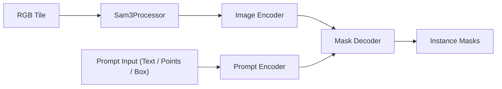
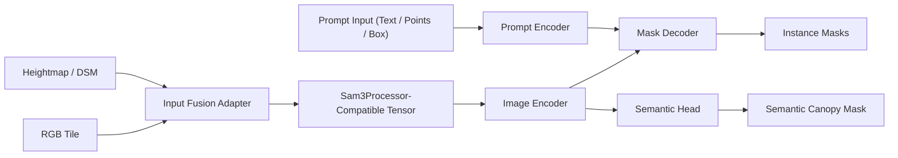

# SAM Architecture Variants

Evaluate architecture and transfer-learning method separately to avoid confounded results.

## Reference architecture: SAM3 in this project

This is the baseline structure used before trying architecture variants.

## Variant A: Backbone scale sweep
- Compare small/base/large checkpoints (or nearest available sizes).

Expected tradeoff:
- Smaller models: faster inference.
- Larger models: potentially better boundary detail and small-object recall.

## Variant B: High-quality decoder variants
- Use SAM-compatible HQ decoders (if available in the stack).

Expected tradeoff:
- Better boundary quality, moderate runtime increase.

## Variant C: Efficient or Mobile SAM variants
- Benchmark compact models for throughput-constrained use.

Expected tradeoff:
- Strong deployment speed, possible accuracy loss.

## Variant D: Multispectral-ready front-end adapter
- If NIR or extra bands exist, compare:
1. `N -> 3` projection adapter.
2. Dual-branch feature fusion.

Expected tradeoff:
- More input signal and better canopy separation, with added model complexity.

## Variant E: Multi-task SAM wrapper
- Instance decoder plus semantic segmentation head trained jointly.

Expected tradeoff:
- Better coarse region consistency and more complex loss balancing.

## Example variant architecture: RGB+Height + multi-task output

This variant combines:
- [Multimodal adapter](./adaptation_methods.md) for RGB + height input.
- [Multi-task training](./adaptation_methods.md) for instance and semantic outputs.

See also:
- [Transfer Learning Methods](./adaptation_methods.md)
- [Data Requirements](./data_requirements.md)
- [Experiment Roadmap](./experiment_roadmap.md)
